# 5. User Journey Flows

## 5.1 Wanjiku's Quality Feedback Loop

**The Farmer's Daily Quality Improvement Cycle**

This is the core value delivery journey - transforming quality data into farmer behavior change.

```mermaid
flowchart TD
    subgraph Morning["🌅 MORNING (5:30 AM)"]
        A[Wanjiku Plucks Tea] --> B{Applies Previous Tip?}
        B -->|Yes| C[Selects Only 2 Leaves + Bud]
        B -->|No/Forgot| D[Plucks Habitually]
    end

    subgraph Collection["📦 COLLECTION (11:00 AM)"]
        C --> E[Delivers to Collection Point]
        D --> E
        E --> F[Peter Tags Bag with Farmer ID]
        F --> G[Receipt Printed]
        G --> H[Wanjiku Returns Home]
    end

    subgraph Factory["🏭 FACTORY (2:00 PM)"]
        F --> I[Bag Arrives at Factory]
        I --> J[Grace Scans QR Code]
        J --> K[AI Grades 100% of Leaves]
        K --> L{Primary % Result}
    end

    subgraph CloudPlatform["☁️ CLOUD PLATFORM"]
        L -->|≥85%| M[WIN Category]
        L -->|70-84%| N[WATCH Category]
        L -->|<70%| O[ACTION NEEDED Category]
        M --> P[Generate Celebration SMS]
        N --> Q[Generate Encouragement SMS]
        O --> R[Generate Coaching SMS]
        P --> S[Identify Top Leaf Issue]
        Q --> S
        R --> S
        S --> T[Compose 160-char SMS]
    end

    subgraph Delivery["📱 DELIVERY (3:00 PM)"]
        T --> U[SMS Sent to Wanjiku]
        U --> V{Wanjiku Reads SMS}
        V -->|Understands| W[Notes Tip for Tomorrow]
        V -->|Confused| X[Calls Voice IVR]
        X --> Y[Hears Full Explanation in Swahili]
        Y --> W
    end

    subgraph NextDay["🔄 NEXT DAY"]
        W --> Z[Applies Tip During Plucking]
        Z --> A
    end
```

**Key Flow Characteristics:**

| Characteristic | Implementation |
|----------------|----------------|
| **Time-bound** | 5:30 AM pluck → 3:00 PM feedback = <10 hours |
| **Closed loop** | Every delivery generates actionable feedback |
| **Escape hatch** | Voice IVR for confusion/clarification |
| **Progressive** | Each cycle reinforces learning |

---

## 5.2 Joseph's Daily Operations

**Factory Quality Manager's Action-First Workflow**

Joseph's journey answers: "What should I do today?" within 5 seconds of opening the dashboard.

```mermaid
flowchart TD
    subgraph Morning["🌅 MORNING (6:00 AM)"]
        A[Joseph Opens Dashboard] --> B[Command Center Loads]
        B --> C{Scan Action Strip}
    end

    subgraph Triage["🎯 TRIAGE (First 30 seconds)"]
        C --> D[See: 7 ACTION NEEDED]
        C --> E[See: 23 WATCH]
        C --> F[See: 145 WINS]
        D --> G{Priority Assessment}
        G -->|Repeat Offender| H[View Farmer Card]
        G -->|First Time| I[Monitor for Pattern]
    end

    subgraph Action["⚡ ACTION (Next 2-5 min)"]
        H --> J{Choose Action}
        J -->|Call Farmer| K[Click Call Button]
        K --> L[Phone Opens with Number]
        L --> M[Log Call Outcome]
        J -->|Assign Extension| N[Click Assign Button]
        N --> O[Select Extension Officer]
        O --> P[Officer Gets Notification]
        J -->|Send Message| Q[Click Message Button]
        Q --> R[WhatsApp Opens with Template]
    end

    subgraph Followup["📋 FOLLOW-UP"]
        M --> S[Update Farmer Status]
        P --> T[Track in Assignments Panel]
        R --> S
        T --> U{Officer Visits}
        U -->|Success| V[Officer Marks DONE]
        V --> W[Joseph Sees Resolution]
        U -->|No Improvement| X[Escalate or Revisit]
    end

    subgraph Patterns["📊 PATTERN ANALYSIS (Weekly)"]
        W --> Y[Review Collection Point Heatmap]
        Y --> Z{Identify Systemic Issues}
        Z -->|Transport Problem| AA[Schedule with Logistics]
        Z -->|Training Gap| AB[Request Group Session]
        Z -->|Seasonal| AC[Note for Next Year]
    end
```

**Key Flow Characteristics:**

| Characteristic | Implementation |
|----------------|----------------|
| **5-Second Answer** | ACTION NEEDED count visible immediately |
| **One-Click Actions** | Call/Assign/Message from farmer card |
| **Delegation Tracking** | Extension officer assignments visible |
| **Pattern Recognition** | Weekly heatmaps reveal systemic issues |

---

## 5.3 Factory Owner ROI Review

**Subscription Value Validation Journey**

The Owner needs proof the system works - clear ROI visible in under 60 seconds.

**Key Flow Characteristics:**

| Characteristic | Implementation |
|----------------|----------------|
| **Summary First** | Hero metrics answer "Is this working?" in 10 seconds |
| **Progressive Disclosure** | Details on demand, not overwhelming |
| **Shareable** | Export/download for board presentations |
| **Context** | Regional benchmarks provide competitive insight |

---

## 5.4 Farmer Registration

**New Farmer Onboarding Flow**

One-time registration that creates the foundation for all future quality tracking.

**Key Flow Characteristics:**

| Characteristic | Implementation |
|----------------|----------------|
| **Fast** | 3-5 minutes, doesn't block queue |
| **Phone Verification** | Ensures SMS delivery works |
| **Physical ID** | Card survives rural conditions |
| **Welcome Message** | Sets expectation for feedback loop |
| **Error Recovery** | Graceful fallbacks for tech failures |

---

## 5.5 Journey Patterns

Across all user flows, these reusable patterns standardize the experience:

**Navigation Patterns:**

| Pattern | Description | Used In |
|---------|-------------|---------|
| **Action Strip** | Three-column status categories (ACTION/WATCH/WIN) | Joseph Dashboard, Platform Admin |
| **Summary First** | Hero metric visible before any scrolling | Owner ROI, Factory Overview |
| **One-Click Action** | Call/Assign/Message directly from list item | Joseph Operations, Farmer Cards |
| **Progressive Disclosure** | Details expand on demand, not by default | Owner Drill-down, Pattern Analysis |

**Decision Patterns:**

| Pattern | Description | Used In |
|---------|-------------|---------|
| **Category Triage** | RED → YELLOW → GREEN priority order | Joseph Triage, Alerts |
| **Threshold Triggers** | Automatic categorization by Primary % | All Quality Events |
| **Delegation with Tracking** | Assign → Notify → DONE keyword | Extension Officer Flow |
| **Confirmation Loops** | SMS verification, action acknowledgment | Registration, Assignments |

**Feedback Patterns:**

| Pattern | Description | Used In |
|---------|-------------|---------|
| **Visual Status** | ✅/⚠️/🔴 immediate emotional feedback | Farmer SMS, Dashboard Cards |
| **Progress Trajectory** | "Up from X% last week" shows improvement | Farmer SMS, Owner ROI |
| **Celebration Moments** | Acknowledge wins explicitly | WIN SMS, Joseph Notifications |
| **Actionable Tips** | Specific, achievable next step in every message | Farmer SMS, Action Plans |

---

## 5.6 Flow Optimization Principles

**1. Minimize Steps to Value**

| Journey | Steps to Value | Optimization |
|---------|---------------|--------------|
| Wanjiku SMS | 1 (read message) | Single SMS contains everything needed |
| Joseph Action | 3 (open → see → act) | Action buttons on first screen |
| Owner ROI | 2 (open → see metric) | Hero metric above fold |

**2. Reduce Cognitive Load**

- **Wanjiku:** One tip per message, not a list
- **Joseph:** Pre-sorted by priority, not raw data
- **Owner:** Trend direction (+18%) more prominent than absolute value

**3. Clear Feedback & Progress**

- Every action has visible confirmation
- Every screen answers "Is this working?"
- Historical comparison always visible

**4. Error Recovery**

| Error | Recovery Path |
|-------|---------------|
| Farmer confused by SMS | Call Voice IVR for explanation |
| Phone number invalid | Clerk corrects, re-verifies |
| Printer fails | Handwritten ID card backup |
| Extension officer doesn't respond | Escalation after 48 hours |
| SMS not delivered | Retry with alternate number or kiosk notice |

**5. Moments of Delight**

| Journey | Delight Moment |
|---------|----------------|
| Wanjiku reaches WIN | Celebration SMS: "⭐ Pongezi! 85% daraja la kwanza!" |
| Joseph clears all ACTION | "🎉 No farmers need immediate attention today" |
| Owner sees improvement | Trend arrow animation, confetti on milestones |
| First-time farmer | Welcome message uses their name |

---
